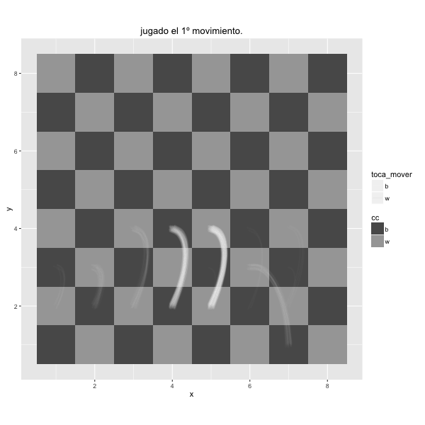

Este artículo es un relato y un análisis en R sobre un Torneo de Ajedrez real. Sin embargo, aunque cada partida, cada jugada y cada resultado, sean reales, los hechos narrados son ficción.

El análisis completo, junto con los dataframes, está publicado en github en este [enlace](https://github.com/jmgaguilera/post_open_ajedrez).

******************************

# Apertura

>Este fin de semana no es uno cualquiera para X. Se juega el torneo que tanto esperaba, su primer torneo oficial desde que comenzó a interesarse en el ajedrez.

******************************

```{r Cargar_datasets, echo=F, message=F, warning=F}
rm(list = ls())

library(magrittr)
library(ggplot2)
library(plyr)
library(dplyr)
library(lattice)
library(latticeExtra)
library(scales)
library(gridExtra)

knitr::opts_knit$set(fig.align="center")

load("games_anonymized.RData")
load("all_movements.RData")
```
Se disponía de un fichero, con todas las partidas desarrolladas en el torneo bajo análisis, del que se eliminaron aquellas que tenían errores por diversas causas. Por ejemplo:

1. No se habían disputado por ausencia de alguno de los contrincantes.
2. Error en los movimientos, bien por que el número de jugadas no cuadraba con el número indicado en el fichero, bien por faltar jugadas en el pgn.

Después de depurar la información, se eliminaron los datos personales, el nombre y lugar del torneo, y los nombres de los jugadores de cada partida, manteniendo la distinción de cada uno de ellos durante la *anonimización*.

El dataframe resultante contiene `r nrow(games)` partidas, que son las que se han utilizado en el análisis.

******************************

>El pabellón del polideportivo en el que se jugaba el torneo había sido preparado para el Torneo. Se habían desplegado mesas en cuidada formación de filas y columnas. En cada una de ellas, había un tablero de cartón para torneo y un reloj...

```{r identificar_num_jugadores, echo=F, message=F, warning=F}
players <- c(games$white, games$black) %>% unique()
```

Participaron `r nrow(players)` jugadores, con las siguientes victorias en cada caso:

```{r contar_victorias, echo=F, message=F, warning=F}
wins <- table(games$result)
wins <- data.frame(blancas=wins["1-0"], tablas=wins["1/2-1/2"], 
                   negras=wins["0-1"], desconocido=wins["*"])

knitr::kable(wins, row.names=F)
```

******************************
La distribución del número de movimientos de las partidas fue la siguiente:


```{r, echo=F, message=F, warning=F}
s <- c(summary(games$plycount))
t <- matrix(s, nrow=1)
colnames(t) <- names(s)
knitr::kable(t)

qplot(plycount,data=games, geom = "histogram", binwidth=10 )
```

******************************
Hay `r nrow(subset(games, games$plycount==1))` partidas en las que solamente se produjo un primer movimiento, aparentemente son aquellas en las que el rival de las blancas no se presentó.

******************************

>Y este es otro más.

Las aperturas están muy estudiadas. Estos son los primeros movimientos de las blancas en el torneo. La densidad refleja el número de veces que se realizó el movimiento.

```{r tablero_primer_mov_blancas, echo=F, message=F, warning=F, fig.width=10, fig.align='center'}
dfboard <- rchess:::.chessboarddata() %>%
  select(cell, col, row, x, y, cc)

dfpaths <- df_all_movements %>% filter(num_ply %in% c(1, 3, 5)) %>%
  left_join(dfboard %>% dplyr::rename(from = cell, x.from = x, y.from = y),
            by = "from") %>%
  left_join(dfboard %>% dplyr::rename(to = cell, x.to = x, y.to = y) %>% select(-cc, -col, -row),
            by = "to") %>%
  mutate(x_gt_y = abs(x.to - x.from) > abs(y.to - y.from),
         xy_sign = sign((x.to - x.from)*(y.to - y.from)) == 1,
         x_gt_y_equal_xy_sign = x_gt_y == xy_sign)

gg_blancas <- ggplot() +
  geom_tile(data = dfboard, aes(x, y, fill = cc)) +
  geom_curve(data = dfpaths,
             aes(x = x.from, y = y.from, xend = x.to, yend = y.to),
             position = position_jitter(width = 0.2, height = 0.2),
             curvature = 0.50, angle = -45, alpha = 0.02, color = "white", size = 1.05) +
  scale_fill_manual(values =  c("gray10", "gray20")) +
  ggtitle("1º, 2º y 3º movimiento con blancas") +
  coord_equal()

dfpaths <- df_all_movements %>% filter(num_ply == c(2, 4, 6)) %>%
  left_join(dfboard %>% dplyr::rename(from = cell, x.from = x, y.from = y),
            by = "from") %>%
  left_join(dfboard %>% dplyr::rename(to = cell, x.to = x, y.to = y) %>% select(-cc, -col, -row),
            by = "to") %>%
  mutate(x_gt_y = abs(x.to - x.from) > abs(y.to - y.from),
         xy_sign = sign((x.to - x.from)*(y.to - y.from)) == 1,
         x_gt_y_equal_xy_sign = x_gt_y == xy_sign)

gg_negras <- ggplot() +
  geom_tile(data = dfboard, aes(x, y, fill = cc)) +
  geom_curve(data = dfpaths,
             aes(x = x.from, y = y.from, xend = x.to, yend = y.to),
             position = position_jitter(width = 0.2, height = 0.2),
             curvature = 0.50, angle = -45, alpha = 0.02, color = "black", size = 1.05) +
  scale_fill_manual(values =  c("gray80", "gray90")) +
  ggtitle("1º, 2º y 3º movimiento con negras") +
  coord_equal()

grid.arrange(gg_blancas, gg_negras, ncol=2)

```
<p align="center">

</p>


******************************

# Juego medio

* Enseñar el número de movimientos de las partidas junto con su distribución.

```{r, echo=F, fig.width=11}
ggplot(df_all_movements, aes(num_ply, Num_Siguientes, colour=toca_mover)) +
  geom_point(colour=alpha("black",1/30)) +
  geom_smooth(span=0.2, level=0.95) +
  scale_colour_manual(values=c("#000000", "#AAAAAA"))

ggplot(df_all_movements, aes(num_ply, Num_Siguientes, colour=toca_mover)) +
  geom_point(colour=alpha("black",1/30)) +
  geom_smooth(span=0.2, level=0.95) +
  facet_grid(. ~ toca_mover) +
  scale_colour_manual(values=c("#000000", "#AAAAAA"))
```

****

```{r, echo=F, fig.width=11}
ggplot(df_all_movements, aes(Num_Siguientes, colour=toca_mover)) +
    geom_histogram(binwidth=2) + facet_grid(.~toca_mover)
```

* crear una animación de movimientos con el paquete animation e incluirla aquí. 

```{r, echo=F, message=F, warning=F, fig.height=9, fig.width=9}
library(lattice)
library(latticeExtra)
library(scales)

cols<-function(n) {
colorRampPalette(c("#5F5F5F", "#FFFFFF"))(20)
}


num_movs = ddply(df_all_movements, c('Num_Siguientes', 'toca_mover', 'num_ply'), summarize, cuenta=length(id))

num_movs = num_movs[order(num_movs$num_ply, num_movs$Num_Siguientes),]
num_movs = subset(num_movs, num_movs$cuenta <=60)

# blancas
num_movs2 = subset(num_movs, num_movs$toca_mover == 'w')
num_movs2$jugada = floor((num_movs2$num_ply+1) / 4) # group two movements
cloud(cuenta ~ jugada*Num_Siguientes, panel.3d.cloud = panel.3dbars, data=num_movs2, col.facet = level.colors(num_movs2$cuenta, at = do.breaks(range(num_movs2$cuenta), 20),col.regions = cols, colors = TRUE), screen=list(z=-20, x=-65), main="Blancas")
# negras
num_movs2 = subset(num_movs, num_movs$toca_mover == 'b')
num_movs2$jugada = floor(num_movs2$num_ply / 4) # group two movements
cloud(cuenta ~ jugada*Num_Siguientes, panel.3d.cloud = panel.3dbars, data=num_movs2, col.facet = level.colors(num_movs2$cuenta, at = do.breaks(range(num_movs2$cuenta), 20),col.regions = cols, colors = TRUE), screen=list(z=-20, x=-65), main="Negras")
```

* Destacar el grupito de jaques abajo

* Enseñar la evolución de la partida (distribución de los movimientos) conforme avanza la partida.

## Número de posiciones en las que hay un número determinado de movimientos siguientes posibles.

```{r, echo=F, fig.width=11, results="asis"}

ggplot(df_all_movements, aes(Num_Siguientes, colour=toca_mover)) +
    geom_histogram(binwidth=2) + facet_grid(.~toca_mover)

cat("Estadísticas de número de movimientos siguientes posibles para las blancas:")
s <- c(summary(df_all_movements[df_all_movements$toca_mover=="w",]$Num_Siguientes))
t <- matrix(s, nrow=1)
colnames(t) <- names(s)
knitr::kable(t)


cat("Estadísticas de número de movimientos siguientes posibles para las negras:")
s <- c(summary(df_all_movements[df_all_movements$toca_mover=="b",]$Num_Siguientes))
t <- matrix(s, nrow=1)
colnames(t) <- names(s)
knitr::kable(t)
cat("\n")

cat("****")
cat("\n")
  
for (i in 1:13) {
  i1 <- i*10
  i2 <- i1 + 10
  titulo <- paste("Estadísticas de número de movimientos siguientes en el rango (", i1, ",", i2, ")", collapse = "")
  
  df_grupo_mov <-df_all_movements[df_all_movements$num_ply >= i1 &
                                df_all_movements$num_ply<=i2,] 
  
  print(ggplot(df_grupo_mov, 
         aes(Num_Siguientes, colour=toca_mover)) +
    ggtitle(titulo) +
    geom_histogram(binwidth=1) + facet_grid(.~toca_mover))

  cat("\n")
  cat("\nEstadísticas de número de movimientos siguientes posibles para las blancas:\n")
  s <- summary(df_grupo_mov[df_grupo_mov$toca_mover=="w",]$Num_Siguientes)
  t <- matrix(s, nrow=1)
  colnames(t) <- names(s)
  print(knitr::kable(t))
  cat("\n")
  
  cat("\n")
  cat("\nEstadísticas de número de movimientos siguientes posibles para las negras:\n")
  S<- summary(df_grupo_mov[df_grupo_mov$toca_mover=="b",]$Num_Siguientes)
  t <- matrix(s, nrow=1)
  colnames(t) <- names(s)
  print(knitr::kable(t))
  cat("\n")
  cat("****")
  cat("\n")
}


```


# Final

```{r buscar_posicion_reyes, echo=F, message=F, warning=F}
reyes_blancos <- subset(df_all_movements, df_all_movements$piece == "White King" & 
                          df_all_movements$status == "game over") %>% select(id, result, to)
reyes_blancos <- left_join(games, reyes_blancos, by = "id") %>% select(id, result = result.x, to) %>% filter(is.na(to)) %>% mutate(to = "e1") %>% rbind(reyes_blancos) %>% mutate(piece = "Rey Blanco")

reyes_negros <- subset(df_all_movements, df_all_movements$piece == "Black King" & 
                          df_all_movements$status == "game over") %>% select(id, result, to)
reyes_negros <- left_join(games, reyes_negros, by = "id") %>% select(id, result = result.x, to) %>% filter(is.na(to)) %>% mutate(to = "e1") %>% rbind(reyes_negros) %>% mutate(piece = "Rey Negro")

reyes <- rbind(reyes_blancos, reyes_negros)

reyes_pos_freq <- ddply(reyes, c("result", "piece", "to"), summarise, freq = length(id))


df_freq <- reyes_pos_freq %>% filter(result != "*") %>%
  plyr::rename(replace=c("to" = "cell")) %>%
  full_join(dfboard, by = "cell")
  
dfboard2 <- data_frame(x = 0:8 + 0.5, y = 0 + 0.5, xend = 0:8 + 0.5, yend = 8 + 0.5)

```
<p align="center">
```{r posición_reyes_porc, echo=F, message=F, warning=F, fig.height=10, fig.width=10}

ggplot(df_freq) +
  geom_tile(data = df_freq,
            aes(x, y, fill = freq)) +
  scale_fill_gradient(low = "gray80",  high = "gray20") +
  geom_text(data = df_freq,
            aes(x, y, label = scales::percent(freq/nrow(games))),
            color = "white", size = 4) +
  scale_x_continuous(breaks = 1:8, labels = letters[1:8]) +
  scale_y_continuous(breaks = 1:8, labels = 1:8)  +
  geom_segment(data = dfboard2, aes(x, y, xend = xend, yend = yend), color = "gray10") +
  geom_segment(data = dfboard2, aes(y, x, xend = yend, yend = xend), color = "gray10") +
  ggtitle("Lugar de finalización de los reyes (en porcentajes)") + 
  facet_grid(piece ~ result) +
  coord_equal() + 
  theme_minimal() +
  theme(legend.position = "none")

```
</p>

<p align="center">
```{r posición_reyes_numero, echo=F, message=F, warning=F, fig.height=10, fig.width=10}
ggplot(df_freq) +
  geom_tile(data = df_freq,
            aes(x, y, fill = freq)) +
  scale_fill_gradient(low = "gray80",  high = "gray20") +
  geom_text(data = df_freq,
            aes(x, y, label = freq),
            color = "white", size = 4) +
  scale_x_continuous(breaks = 1:8, labels = letters[1:8]) +
  scale_y_continuous(breaks = 1:8, labels = 1:8)  +
  geom_segment(data = dfboard2, aes(x, y, xend = xend, yend = yend), color = "gray10") +
  geom_segment(data = dfboard2, aes(y, x, xend = yend, yend = xend), color = "gray10") +
  ggtitle("Lugar de finalización de los reyes (en número de partidas)") + 
  facet_grid(piece ~ result) +
  coord_equal() + 
  theme_minimal() +
  theme(legend.position = "none")
```
</p>
****
= Agradecimientos

* Poner agradecimientos al final